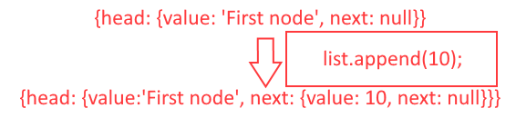

# Linked List Exercise 2

## Description
- Add a value to the end of a linked list, add a value after AND before a specific node in a linked list.

## Visual



## Approach & Efficiency
- For this challenge, I will attempt to search through the linked list and if `next` ever equals `null`, I will know that is the end of the list, and I can insert a new item there. For adding a specific value before or after a specific node, I will search through the linked list through a while loop, and if the current value is ever the one I am looking for, I will insert the new value either before, or one after the value I am currently on.

## Pseudo-code

```Text
First add method keyword
initialize variables
while loop testing if statements
when if statement is true, add value before or after current value
```

## Code 

[JavaScript File](./linked-list.js)