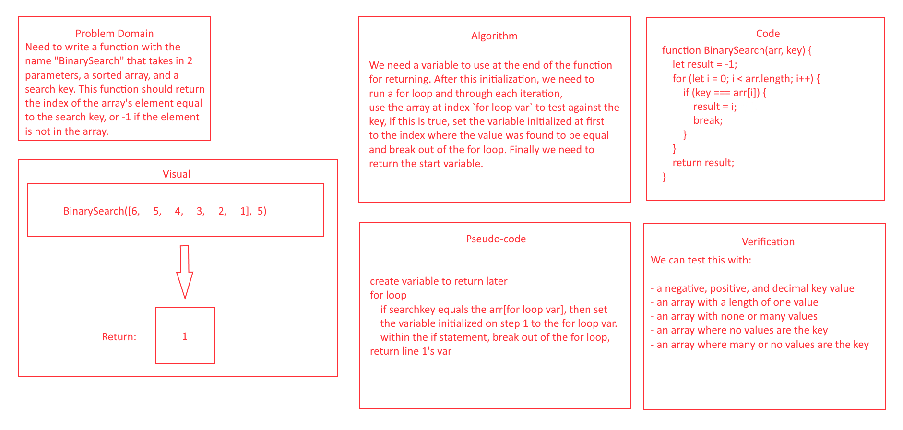

# Array Binary Search

## Description
- Search an array using a search key.

## Whiteboard Process


## Approach & Efficiency
- I misinterpreted this problem at first, so if you check a previous pull you can see another way of solving this problem, just not the "binary search" method that is asked... I redid and sent another pull request to GitHub.

## Solution

``` JavaScript
function BinarySearch(arr, key) {
  let resultIdx = -1;
  // flag is used to break out of while loop when correct answer is found
  let flag = false;
  let halfArr = (arr.length / 2) - 1;
  // below is regex used to match only numbers before the decimal
  let regex = /^([^.]+)/g
  while (!flag) {
  // below rounds the halfArr var down
  halfArr = halfArr.match(regex);
    if (arr[halfArr] > key) {
      halfArr = halfArr / 2
    } else if (arr[halfArr] < key) {
      halfArr = (halfArr + (halfArr / 2))
    } else if (arr[halfArr] === key) {
      flag = true;
      resultIdx = halfArr;
    }
  }
  return resultIdx;
}
```