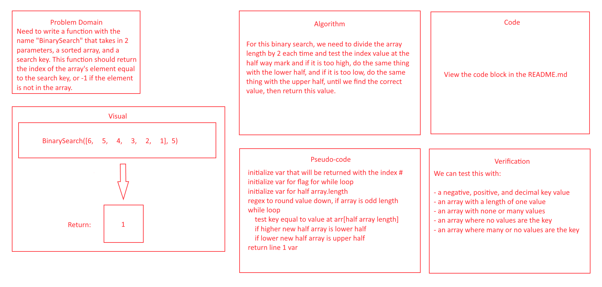

# Array Binary Search

## Description
- Search an array using a search key.

## Whiteboard Process

## Approach & Efficiency
- For this one I thought about how it would be best to test the key against each individual value and worked backwards. I thought about the first issue being how to target each individual value, and thought this could be solved with a simple `for` loop. Then I worked out that the "test" could be ran with a simple `if` comparison statement. I didn't run into any problems. This one was the smoothest code challenge to solve for me.