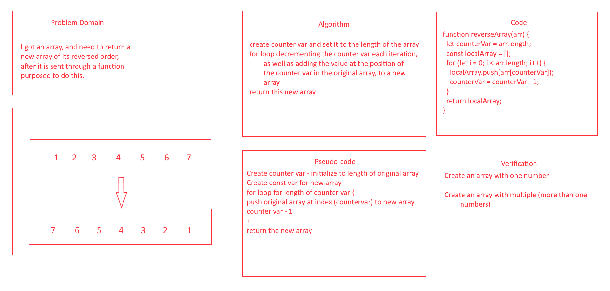

# Reverse an Array

## Description
- Reverse the order of an array.

## Whiteboard Process

## Approach & Efficiency
- I just thought to myself how would I reverse the order of a list? I would start with the end of the list and work my way back. This got me thinking, I should make a temporary variable while in the function to create the new array, just so no data loss bugs or anything like that happens, and return the new array when done. I could create a new variable for the size of the array and use that as the position wanted for the new array. Also - I just realized while typing this out that a bug will occur in the code I wrote due to the array starting its index at 0, but using the .length method, it will be one larger than desired, so to fix you would need to say `arr[counterVar - 1]` instead of `arr[counterVar]`.