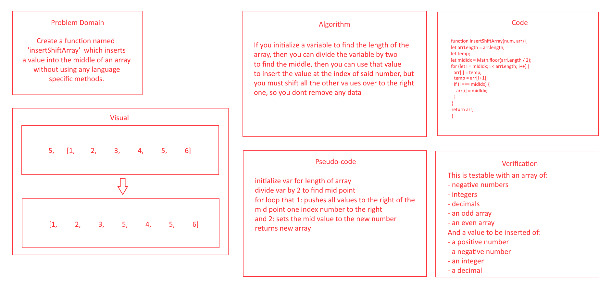

# Reverse an Array

## Description
- The goal of this code challenge is to take a value and insert it into an array, and return the new array.

## Whiteboard Process

## Approach & Efficiency
- I started with the approach that I wrote in the algorithm exactly, and even the pseudo-code wasn't changed, but writing the actual code I realized I came accross a few more problems than originally planned, especially with the constriction of not being able to use any language-specific code, so I had to look up .length to see if that was universal (and it was in c# and Java, the two other languages I checked) so I used that. 