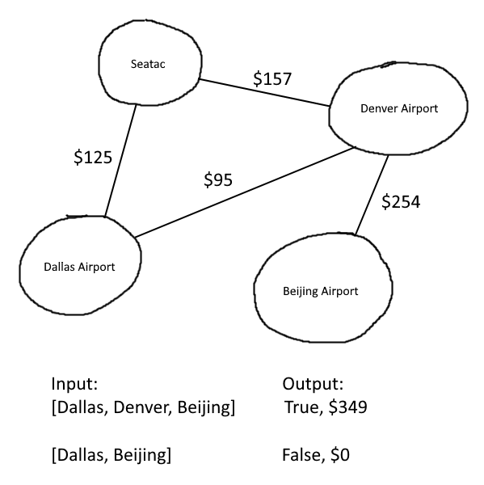

# Challenge Summary
Graphs are data structures which can be summed up as HashMaps with the key (vertex / or node) and value (edges). Each edge (connection between two vertices / or nodes) has an optional 'weight' property. This challenge utilizes a graph to add weights in order of a given node network, either returning `true` if the inserted values are connected via edges with valid weight, or `false` if there are no edges between inserted nodes.

## Whiteboard Process

## Approach & Efficiency

First thing I will do is create a function with the name graphBusinessTrip with the parameter of an array of nodes. This array will be used to for loop through, checking each node's corresponding edge - ensuring the edge list contains the next node in the array, and if it does, will increment the result variable (the total cost of the trip) until the last element in the array is hit. Once this happens, return an object with the properties: `valid: true` and `cost: resultVar`.

|Function|Time|Space|
|---|---|---|
|graphBusinessTrip|O(n^2)|O(1)|

Time is O(n^2) because it loops through each node's edges. n edges with n nodes supplied in arguments.

Space is O(1) since the function is incrementing a single value based on however many arguments (nodes) are inserted.

## Solution
In order for this function to work properly, the argument you need to provide is an array of nodes present in a valid graph (see my [graph implementation](../graph/graph.js) for how I expect the graph to be structured). The nodes provided also need to be connected by edges in order in the array they are provided, along with a valid `weight` (which is the cost of each flight for this example) in each edge.