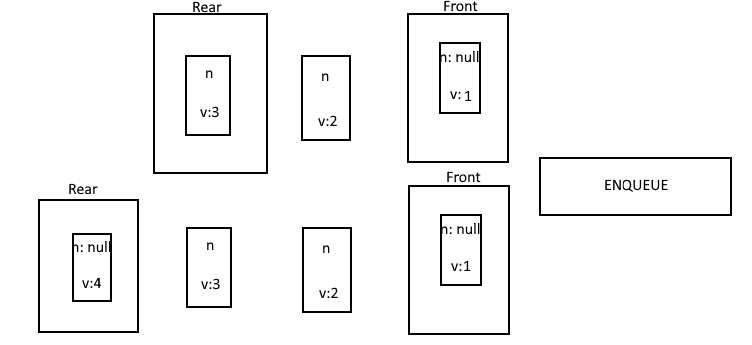
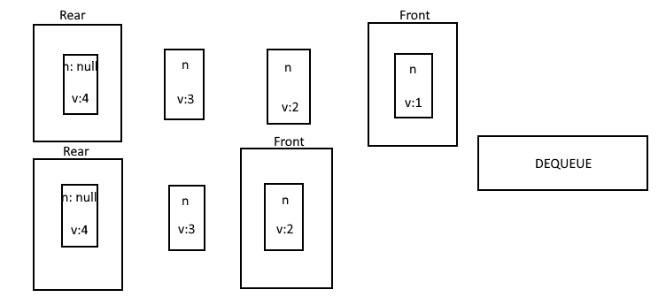

# Stack Queue Pseudo

## Description
- Implement a queue to track what animals have been in a shelter the longest. Create an `Enqueue` method that adds to the queue, and a `Dequeue` method that removes the first item added to the queue and returns said value to the user.

## Visual
- Dequeue:


- Enqueue:



## Approach & Efficiency
- For this challenge, I will use a queue, therefore I can send the animals through the linked list in the order being: First in, first out.

## Pseudo-code

```Text
First create `Enqueue` method taking in animal as parameter,
First thing to do within this method is to create variable for new node using the animal passed into the method,
Then conditonal:
If this.rear exists, that means there is things in the list already and you can:
Add the new animal to this.front.next
Finally set the rear to the new node
If the conditonal is false, else:
Set both the rear and the front to the new node variable created

Next is the `Dequeue` method,
Create a temp variable to this.front
(conditional this.front !== null)
True:
This means that there are items in the queue already, and can set the front (existing queue) to temp.next
Then, clear the data in the temp.next variable for big O
Finally, return the temp.animal
False:
Set this.front equal to null since there are no items in the queue
```

## Code 

[JavaScript File](./animalShelter.js)