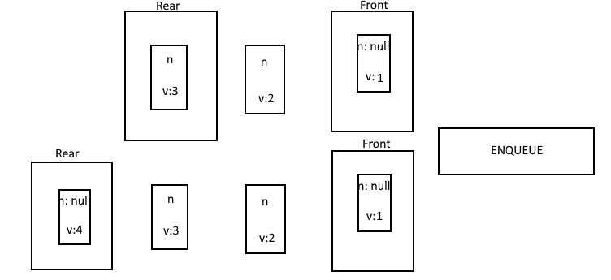
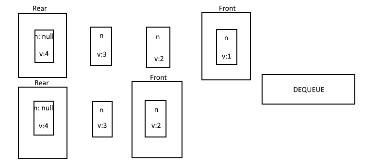

# Stack Queue Pseudo

## Description
- Implement and utilize 2 stacks to manage a queue. Include the methods: `Enqueue` and `Dequeue`.

## Visual
- Dequeue:


- Enqueue:



## Approach & Efficiency
- For this challenge, I will use 2 stacks, one with the list one way, and the other adding to the list inversely. This way I can call upon one if I need to transverse one way, and likewise I can add to the other list inversely.

## Pseudo-code

```Text
First create Enqueue method,
First thing within this method is if statement checking if `this.top` is equal to `top.next`,
If this is true:
This means that the there is no nodes in the list, and the new node needs to be created and set to top.
If this is false:
This means that there is more than one nodes in the list and the new node can be set to top and `top.next` can be set to the previous list
This also means that we need to add this value to the end of the second list (while loop and add to next when next === null)

Next is the Dequeue method,
First thing we need to do is create temp val equal to the second list top val
Then, remove the second list top val by setting the top equal to `top.next`
Finally, return the temp val
```

```Text
In other words, using the methods I used in previous weeks will allow me to easily .push new values into the first stack (enqueue). I will be able to dequeue by adding the values into a second stack from the first stack with .push, and then returning the first popped value from the second stack. This can be thought of as flipping a stack of plates upside down, then doing it once more, and taking off the first plate.
```

## Code 

[JavaScript File](./stackQueuePseudo.js)