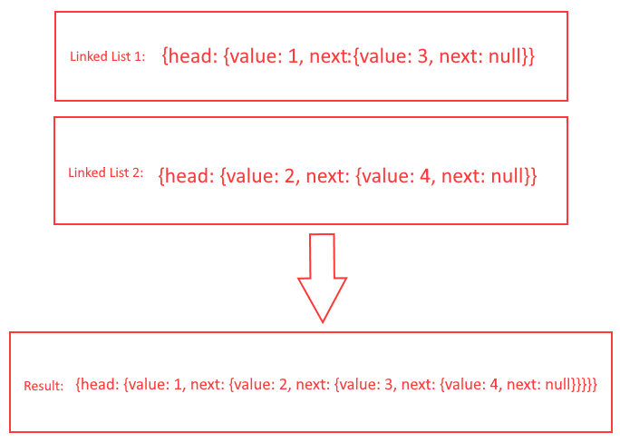

# Zip 2 Linked Lists Together

## Description
- Write a function that takes in 2 linked lists and zips them together into one return linked list.

## Visual



## Approach & Efficiency / Algorithm
- For this challenge, I will initiate a while loop as long as one of the values exist, the loop will continue. The first thing I will do is add the current value of each array to a new array variable. Then I will make the current, the next value in the array.

## Pseudo-code

```Text
First initialize variable for new array,
Initialize current variable to head
while loop checking either current == null
if current value of first linked list is not null, add to new array
if current value of second linked list is not null, add to new array
```

## Code 

[JavaScript File](./zipLists.js)